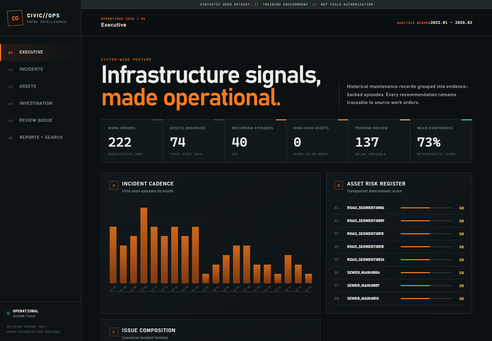
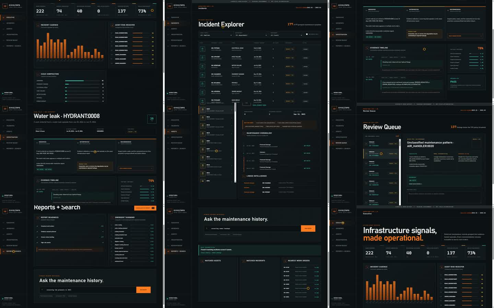

# CivicOps AI

Explainable infrastructure maintenance intelligence for municipal operations teams. CivicOps turns work-order history into bounded incident episodes, auditable confidence and asset-risk scores, evidence-linked preventive actions, and a human review queue.



> The included records are a **Synthetic Demo Dataset**. Findings are decision support, not work authorization, measured field outcomes, or production performance claims.

## Demo Walkthrough

[](docs/demo/civicops-ai-walkthrough.mp4)

[Watch the full 79-second product walkthrough](docs/demo/civicops-ai-walkthrough.mp4). It demonstrates all six operating views, incident filtering and investigation, asset selection, human review, hybrid search, and report export against the containerized demo API.

## What It Does

- Normalizes `WORKORDER.csv`, `WOENTITY.csv`, and `WOCOMMENT.csv` without inflating job counts through many-to-many joins.
- Preserves asset identity as `EntityType:EntityUid`.
- Retains raw comments while producing separate cleaned and PII-redacted forms.
- Generates bounded asset, issue, and time-blocked candidates with vectorized TF-IDF similarity scoring; optional sentence-transformer and FAISS support remains available.
- Groups weighted edges into incidents while enforcing a maximum full-episode span.
- Separates observations, interpretations, possible causes, and recommended actions through a configurable Agent Logic Package (ALP).
- Rejects any insight that cites a work order outside its retrieved evidence set.
- Routes findings below a policy threshold into persisted human review.
- Provides six responsive operating views plus hybrid search and a Markdown briefing export.

## Quick Start

### Docker

```bash
docker compose up --build
```

Open `http://localhost:3000`. The API and interactive OpenAPI schema are available at `http://localhost:8000/api/v1/health` and `http://localhost:8000/docs`.

### Local Development

Requires Python 3.12-3.14 and Node.js 20 or newer.

```bash
python -m pip install -e "backend[dev]"
npm --prefix frontend install
python scripts/generate_demo_data.py
python scripts/run_pipeline.py
uvicorn app.main:app --app-dir backend --reload
```

In a second terminal:

```bash
npm --prefix frontend run dev
```

Open `http://localhost:5173`. Vite proxies `/api` to the service on port 8000.

## Verification

```bash
make test
make lint
make build
```

Equivalent commands on systems without Make:

```bash
python -m pytest tests
ruff check backend/app scripts tests
ruff format --check backend/app scripts tests
npm --prefix frontend run typecheck
npm --prefix frontend test
npm --prefix frontend run build
docker compose build
```

## Operations UI

1. **Executive**: system posture, incident cadence, issue mix, risk register, and cited pattern ledger.
2. **Incident Explorer**: filterable incident table with risk, evidence window, confidence, recurrence, and resolution state.
3. **Asset Intelligence**: ranked asset risk with reasons, maintenance chronology, and linked incident intelligence.
4. **AI Investigation**: separate observed, interpreted, and recommended lanes; technician evidence; grouping reasons; confidence decomposition; grounding status.
5. **Review Queue**: low-confidence findings ordered for confirmation, rejection, or evidence hold with reviewer notes.
6. **Reports + Search**: report readiness, emergent comment taxonomy, hybrid query interpretation, linked results, and Markdown download.

Additional captures are in [`docs/screenshots`](docs/screenshots).

## Data Input

Place authorized challenge files in `data/raw/` using these names:

```text
data/raw/WORKORDER.csv
data/raw/WOENTITY.csv
data/raw/WOCOMMENT.csv
```

Then run:

```bash
python scripts/run_pipeline.py --source data/raw
```

Operational data fails closed. Set these values in `.env` before starting the API or UI:

```text
CIVICOPS_DEMO_MODE=false
CIVICOPS_OPERATOR_API_KEY=replace-with-a-long-random-secret
```

The UI prompts for the operator key and keeps it in browser session storage only. A production deployment should terminate authenticated access at an organizational gateway and inject `X-CivicOps-Key` upstream rather than distribute a shared key broadly.

Column aliases are resolved for common ID, timestamp, description, department, status, priority, entity, relation, and comment names. Missing required columns fail loudly. Invalid dates and identifiers are rejected and counted in the pipeline result.

`data/raw/**` is ignored except for `.gitkeep`. Do not commit private municipal records.

## Explainability Contract

Every generated finding contains:

- Exact supporting and contradicting `WorkOrderId` values.
- Measured observations distinct from rule-derived interpretation.
- A possible cause support level: `SUPPORTED`, `LIKELY`, `POSSIBLE`, or `UNKNOWN`.
- A deterministic confidence score with component values and conflict penalty.
- A recommended action that is explicitly not an authorization.

Direct cause language is only marked `SUPPORTED` when a technician note contains cause evidence. Otherwise the ALP uses cautious language or states that evidence is insufficient.

See [`docs/ARCHITECTURE.md`](docs/ARCHITECTURE.md) for formulas and data flow.

## Audit and Calibration

Stop the API before using the local audit CLI because DuckDB permits only one process to own a writable database file.

```bash
python scripts/sample_audit.py --size 50 --seed 42
```

Review `data/audit_sample.csv` and set `actual_correct` to `1` or `0`. Then run:

```bash
python scripts/evaluate_audit.py
```

Outputs are written to `data/calibration/metrics.json` and `data/calibration/calibration.png`. They are intentionally ignored because they represent evaluator-specific results. Details are in [`docs/EVALUATION.md`](docs/EVALUATION.md).

## Configuration

Copy `.env.example` to `.env` if defaults need to change. Settings use the `CIVICOPS_` prefix.

| Variable | Default | Purpose |
| --- | --- | --- |
| `CIVICOPS_DATABASE_URL` | `duckdb:///./data/civicops.duckdb` | SQLAlchemy database URL |
| `CIVICOPS_DATA_DIR` | `./data` | Source data root |
| `CIVICOPS_DEMO_MODE` | `true` | Honest demo labeling |
| `CIVICOPS_EMBEDDING_MODEL` | `all-MiniLM-L6-v2` | Optional semantic model |
| `CIVICOPS_CONFIDENCE_REVIEW_THRESHOLD` | `0.72` | Review routing threshold |
| `CIVICOPS_LLM_PROVIDER` | `deterministic` | Reserved provider selection |
| `CIVICOPS_OPERATOR_API_KEY` | unset | Required for operational data and API pipeline runs |
| `VITE_API_URL` | `/api/v1` locally | Browser API base URL |

OpenAI, Anthropic, and Ollama adapters exist behind the provider abstraction. The default pipeline does not call them and needs no API key. External synthesis must receive only redacted evidence and must still pass Pydantic validation and citation grounding before persistence.

## Repository Layout

```text
backend/app/          FastAPI, ETL, retrieval, ALP, scoring, persistence
frontend/src/         React control-room application
scripts/              Demo generation, pipeline, audit, calibration
tests/                Backend unit and integration tests
data/demo/            Seeded synthetic source tables
data/raw/             Ignored private input location
docs/                 Architecture, evaluation, API, screenshots
```

## Scope Boundaries

- The 72% review threshold is a demo policy, not a validated operating threshold.
- Risk is a transparent prioritization score, not a failure probability.
- Resolution is reported only from direct note signals; missing evidence remains `UNKNOWN`.
- Related assets are inferred from work-order co-attachment, never from UID alone.
- Canonical snapshot replacement is transactional; review writes and pipeline replacement are serialized in-process.
- The deterministic pipeline is batch-first. Multi-process writes and larger deployments should move to PostgreSQL.
- Markdown export is implemented; PDF export is outside the MVP.
