# Architecture

## System Shape

```mermaid
flowchart LR
    A[CSV source tables] --> B[Polars normalization]
    B --> C[Clean and redact comments]
    C --> D[Corpus-trigger retrieval and temporal features]
    D --> E[Bounded candidate blocks]
    E --> F[Weighted candidate graph]
    F --> G[Span-bounded incident groups]
    G --> H[ALP observations and actions]
    H --> I[Confidence and asset risk]
    I --> J[Citation grounding gate]
    J --> K[(DuckDB via SQLAlchemy)]
    K --> L[FastAPI]
    L --> M[React operations UI]
```



The pipeline is deterministic and batch-first. Every run still executes retrieval, evidence-prompt construction, structured synthesis, validation, and grounding. The default provider is an offline deterministic adapter; LLM adapters are optional downstream alternatives and never required for ingestion, grouping, or scoring.

## Data Invariants

- A work order is uniquely counted by `WorkOrderId`.
- An asset key is `UPPER(EntityType) + ":" + UPPER(EntityUid)`; `appliesto`/primary and attached/context roles remain distinct.
- Entity joins do not create additional jobs.
- Raw, clean, and redacted comments are separate fields.
- Descriptions remain metadata and do not support classification, retrieval, or displayed technician evidence.
- Every persisted insight has at least one supporting work order.
- Supporting and contradicting citations must be a subset of the incident evidence set.
- An incident's full first-to-last span cannot exceed the configured episode maximum.

## Retrieval and Grouping

The default offline embedding index uses TF-IDF unigrams/bigrams. Search queries and corpus-mined ALP trigger exemplars use cosine nearest neighbors. If the optional ML dependencies are installed, normalized sentence-transformer embeddings use a FAISS inner-product index. Every work order records whether its issue family came from an exact mined phrase, nearest-trigger retrieval, or an uncertain below-threshold match, plus the selected exemplar and score.

Pipeline candidate generation considers every time-windowed pair within each primary-asset history and at most 12 forward neighbors in broader issue-family blocks, then scores only those candidates in one vectorized pass. It never constructs a global all-pairs matrix. Unrelated primary assets cannot merge regardless of text similarity or a shared attached location.

Each candidate receives:

```text
edge = 0.35 * semantic_similarity
     + 0.30 * asset_match
     + 0.15 * temporal_proximity
     + 0.20 * issue_agreement
```

Edges at or above the configured `0.60` threshold with a shared primary asset are considered by union-find. Different known issue families cannot merge. A merge is rejected when the resulting component would exceed 180 days or would no longer have one primary asset common to every work order, preventing transitive chains and bridge records from creating invalid episodes. Every accepted edge stores its component scores and human-readable reasons. An episode is called recurring only when at least three linked work orders support its selected issue family.

## Agent Logic Package

Rules in `backend/app/alp/rules.yaml` map canonical issue families to:

- A user-facing label.
- A cautious interpretation.
- A possible cause with explicit support level.
- A preventive action.

The engine first constructs direct observations from episode dates, count, identifiers, recurrence, maintenance interventions, and resolution signals. Interpretation never mutates those observations. Cause support is upgraded to `SUPPORTED` only when a technician sentence directly documents a cause pattern.

## Confidence

Confidence is an auditable evidence-consistency score used to rank review priority. The pipeline stores the raw score and applies a monotonic calibration artifact when one is configured. A calibrated score is not a correctness probability unless its artifact was trained and validated against manual labels:

```text
confidence = 0.25 * semantic_consistency
           + 0.20 * asset_consistency
           + 0.15 * temporal_consistency
           + 0.20 * evidence_strength
           + 0.20 * issue_agreement
           - conflict_penalty
```

Scores are clamped to `[0, 1]`. Levels are `HIGH >= 0.82`, `MEDIUM >= 0.65`, and `LOW` otherwise. Findings below `0.72` enter the review queue. Demo mode loads a checked-in provisional curve marked `synthetic`; official data requires a labeled artifact and held-out threshold evaluation before operational use.

## Asset Risk

Risk is a 0-100 prioritization index:

```text
risk = 25 * frequency
     + 30 * recurrence
     + 15 * severity
     + 15 * unresolved_episodes
     + 15 * recent_density
```

Each component is clamped to `[0, 1]`; API responses include plain-language reasons. Risk is not a failure probability.

## Persistence and Reruns

SQLAlchemy is the persistence boundary and DuckDB is the local adapter. Pipeline reruns rebuild the canonical schema inside one DuckDB transaction. Any write or DDL failure rolls the full replacement back. Parent and child inserts use explicit flush barriers. Human decisions and pipeline history are restored in the same transaction; historical reviews whose generated insight disappears remain archived by logical insight ID.

The default database is appropriate for a single-service demonstration. A production multi-user deployment should use PostgreSQL and transactional staging-table replacement.

## RAG and Report Contract

For each incident, bounded retrieval supplies work-order evidence to a redacted evidence prompt. The selected provider returns a `MaintenanceInsight`, which Pydantic validates before field completion, calibration metadata, claim-level evidence mapping, and grounding checks. `GET /api/v1/reports/maintenance.json` validates the complete `PM_INSIGHT_REPORT` envelope before returning it; optional pagination is explicit through `limit` and `offset`.

## Security and Privacy

- Private input is ignored by source control.
- PII patterns redact email, phone, employee IDs, and contextual person names.
- Raw text remains available only in local persistence for human evidence review.
- API responses expose only redacted comment derivatives.
- Prompt construction uses `redacted_notes`, never raw comments, and applies a second external-only pass for address-like locations.
- Authenticated operator views retain operational site and asset identifiers; they are not anonymous exports.
- External provider calls use timeouts and HTTP status checks.
- Output must pass the structured model and grounding gate.
- Human issue-family corrections regenerate the family-dependent title, summary, interpretation, cause posture, and default action; reruns preserve the correction.

Regex redaction is defense in depth for the demo, not a replacement for an organizational DLP program.

All non-health endpoints fail closed when the persisted source is not the bundled demo dataset. They require an `X-CivicOps-Key` header matching `CIVICOPS_OPERATOR_API_KEY`. API-triggered pipeline runs always require that key. Production deployments should place the service behind an identity-aware gateway.
