# Architecture

## System Shape

```mermaid
flowchart LR
    A[CSV source tables] --> B[Polars normalization]
    B --> C[Clean and redact comments]
    C --> D[Taxonomy and temporal features]
    D --> E[Bounded candidate blocks]
    E --> F[Weighted candidate graph]
    F --> G[Span-bounded incident groups]
    G --> H[ALP observations and actions]
    H --> I[Confidence and asset risk]
    I --> J[Citation grounding gate]
    J --> K[(DuckDB via SQLAlchemy)]
    K --> L[FastAPI]
    L --> M[React operations UI]
```



The pipeline is deterministic and batch-first. LLM adapters are downstream alternatives for structured synthesis, not dependencies for data ingestion, grouping, scoring, or default insight generation.

## Data Invariants

- A work order is uniquely counted by `WorkOrderId`.
- An asset key is `UPPER(EntityType) + ":" + UPPER(EntityUid)`; primary and related roles remain distinct.
- Entity joins do not create additional jobs.
- Raw, clean, and redacted comments are separate fields.
- Descriptions can support retrieval and taxonomy but are not displayed as technician evidence.
- Every persisted insight has at least one supporting work order.
- Supporting and contradicting citations must be a subset of the incident evidence set.
- An incident's full first-to-last span cannot exceed the configured episode maximum.

## Retrieval and Grouping

The default offline embedding index uses TF-IDF unigrams/bigrams. Search queries use cosine nearest neighbors. If the optional ML dependencies are installed, normalized `all-MiniLM-L6-v2` embeddings use a FAISS inner-product index.

Pipeline candidate generation considers at most 12 forward neighbors per shared-asset or issue-family block within a time window, then scores those pairs in one vectorized pass. It does not compute global all-pairs distances. Unrelated assets cannot merge regardless of text similarity; a shared primary asset receives full asset weight and a shared related attachment receives half weight.

Each candidate receives:

```text
edge = 0.35 * semantic_similarity
     + 0.30 * asset_match
     + 0.15 * temporal_proximity
     + 0.20 * issue_agreement
```

Edges at or above `0.67` are considered by union-find. A merge is rejected when the resulting component would exceed 180 days, preventing transitive chains from creating unbounded episodes. Every accepted edge stores its component scores and human-readable reasons.

## Agent Logic Package

Rules in `backend/app/alp/rules.yaml` map canonical issue families to:

- A user-facing label.
- A cautious interpretation.
- A possible cause with explicit support level.
- A preventive action.

The engine first constructs direct observations from episode dates, count, identifiers, recurrence, maintenance interventions, and resolution signals. Interpretation never mutates those observations. Cause support is upgraded to `SUPPORTED` only when a technician sentence directly documents a cause pattern.

## Confidence

Confidence is an auditable weighted score:

```text
confidence = 0.25 * semantic_consistency
           + 0.20 * asset_consistency
           + 0.15 * temporal_consistency
           + 0.20 * evidence_strength
           + 0.20 * issue_agreement
           - conflict_penalty
```

Scores are clamped to `[0, 1]`. Levels are `HIGH >= 0.82`, `MEDIUM >= 0.65`, and `LOW` otherwise. Findings below `0.72` enter the review queue. These defaults must be calibrated with manual labels before operational deployment.

## Asset Risk

Risk is a 0-100 prioritization index:

```text
risk = 25 * frequency
     + 30 * recurrence
     + 15 * severity
     + 15 * unresolved_episodes
     + 15 * recent_density
```

Each component is clamped to `[0, 1]`; API responses include plain-language reasons. Risk is not a failure probability.

## Persistence and Reruns

SQLAlchemy is the persistence boundary and DuckDB is the local adapter. Pipeline reruns rebuild the canonical schema inside one DuckDB transaction. Any write or DDL failure rolls the full replacement back. Parent and child inserts use explicit flush barriers. Human decisions and pipeline history are restored in the same transaction; historical reviews whose generated insight disappears remain archived by logical insight ID.

The default database is appropriate for a single-service demonstration. A production multi-user deployment should use PostgreSQL and transactional staging-table replacement.

## Security and Privacy

- Private input is ignored by source control.
- PII patterns redact email, phone, employee IDs, and contextual person names.
- Raw text remains available only in local persistence for human evidence review.
- API responses expose only redacted comment derivatives.
- Prompt construction uses `redacted_notes`, never raw comments.
- External provider calls use timeouts and HTTP status checks.
- Output must pass the structured model and grounding gate.

Regex redaction is defense in depth for the demo, not a replacement for an organizational DLP program.

All non-health endpoints fail closed when the persisted source is not the bundled demo dataset. They require an `X-CivicOps-Key` header matching `CIVICOPS_OPERATOR_API_KEY`. API-triggered pipeline runs always require that key. Production deployments should place the service behind an identity-aware gateway.
