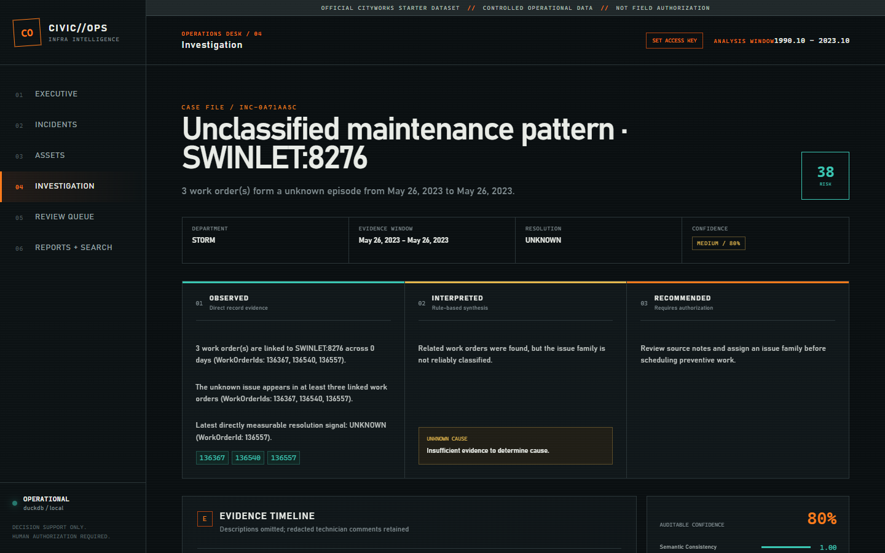

# CivicOps AI
## From dark work-order history to defensible maintenance decisions

**Submission presentation**

> CivicOps turns loose municipal work orders into bounded incident episodes, evidence-linked maintenance insight, transparent risk prioritization, and a human authorization workflow.

### Data boundary

- **Bundled synthetic/demo:** `data/demo/` is safe to run and ships with this repository.
- **Official Cityworks:** the challenge export is imported locally into ignored `data/raw/`; its CSV payloads are not committed.
- **Operating principle:** every conclusion remains decision support, not work authorization or a measured field outcome.

**Artifacts:** [submission checklist](SUBMISSION_CHECKLIST.md) | [architecture](ARCHITECTURE.md) | [API guide](API.md)

**Talk track:** CivicOps makes the maintenance record useful without pretending that a model can replace a dispatcher, technician, or engineering approval.

---

# Slide 02 | Problem and value

## The failure pattern is in the notes, not the schema

The challenge supplies loose jobs, attached entities, and free-text comments. It does not supply incident IDs, causes, resolution outcomes, shared failure modes, or PM interval changes.

| Rubric | CivicOps answer |
| --- | --- |
| ALP logic depth, 30 | Mine municipal crew language, then map observations to cautious interpretations and actions. |
| Architectural integrity, 30 | Normalize once, retrieve with bounded candidates, persist the reasoning trail, and keep generation downstream. |
| Explainability, 20 | Cite exact `WorkOrderId` values and expose the evidence, match reasons, confidence components, and review state. |
| Data normalization, 10 | Respect table grain, composite asset identity, timestamps, boilerplate, catch-alls, and PII. |
| Operational impact, 10 | Give a maintenance manager a ranked queue, asset context, investigation view, review loop, and dispatcher report. |

**Value:** move from "what jobs exist?" to "which sequence deserves attention, why, and what should a person verify next?"

**Talk track:** The product does not summarize isolated rows. It reconstructs an evidence-bound story that a maintenance manager can inspect and challenge.

---

# Slide 03 | Corpus and boundaries

## One product, two clearly labeled data modes

| Mode | Evidence in this submission | What it proves |
| --- | --- | --- |
| **Synthetic/demo** | `data/demo/WORKORDER.csv`, `WOENTITY.csv`, `WOCOMMENT.csv` | Reproducible pipeline behavior, test cases, and citation examples. |
| **Official Cityworks** | Local import described in `docs/STARTER_TEMPLATE.md`; source files remain ignored | Full-source integration and deterministic pipeline counts documented from a local smoke run. |
| **Product captures** | Screenshots and walkthrough documented in `README.md` | The operating views and reports; each run must retain its dataset label and redaction status. |

### Scale

- Official challenge export: 37,778 work orders, 867,448 entity links, and 33,572 comments across 2008 to 2023.
- Bundled demo fixture: 224 work-order rows, 237 entity rows, and 444 comments; it contains 222 generated jobs plus one duplicate and one invalid-date row.
- A local default demo run retained 222 unique work orders, 74 composite asset keys, and 119 incident groups. It produced 30 recurring groups, routed 76 findings to review, and applied the synthetic contract calibration artifact.

The demo run is a software smoke result, not an accuracy result. The official local smoke counts are also deterministic pipeline counts, not field-performance claims.

**References:** [starter integration](STARTER_TEMPLATE.md) | [challenge brief](../challenge.md) | [official notebook](../aisa_challenge.ipynb)

**Talk track:** We show exactly which claims come from the safe fixture, which come from the locally imported challenge export, and which are product behavior rather than model performance.

---

# Slide 04 | Exploration and learning

## The notebook changed the design

The official notebook is the exploration trail. Sections 1 to 7 establish the data traps; Sections 8 to 11 test history retrieval, generation, and procedure retrieval.

- Count jobs by unique `WorkOrderId`, never by rows after the work-order-to-asset join.
- Build asset identity as `EntityType:EntityUid`; `EntityUid` alone collides.
- Treat `ApplyToEntity` as template metadata, not the attached asset.
- Remove dispatcher boilerplate before embeddings; retain raw, clean, and redacted derivatives separately.
- Reject sentinel dates before time-series work; the official source includes 1970 and 2222 values.
- Do not use `Priority` as failure severity; the notebook finds it near-default for most jobs.
- Do not use `Description` as technician evidence; it is a template label.
- Use the notebook's Section 5 similarity experiment to understand vocabulary, not to claim recurrence or resolution.
- Treat dense sites and long histories as candidates until timing, text, asset identity, and a baseline support the inference.

### Progression

`join and inspect -> clean and retrieve -> group episodes -> encode ALP -> score and review -> export`

**Learning:** vocabulary retrieval can find related language, but only sequence reasoning can test recurrence, intervention, resolution, and action fit.

**Talk track:** The exploration prevented two common failures: inflated job counts and fluent answers built on the wrong grain or the wrong text.

---

# Slide 05 | Approach and reasoning

## Reconstruct the sequence before writing the insight

```text
CSV source tables
  -> Polars projection, validation, normalization
  -> clean and redact comments
  -> issue-family retrieval and temporal features
  -> bounded candidate blocks
  -> weighted evidence graph and 180-day episodes
  -> ALP observations, interpretation, cause posture, action
  -> confidence and asset risk
  -> citation grounding gate
  -> DuckDB -> FastAPI -> React operations UI
```

### Grouping contract

- Score same-primary-asset history within a time window and at most 12 forward neighbors in issue-family blocks.
- Weight each candidate edge: `0.35 semantic + 0.30 asset + 0.15 temporal + 0.20 issue agreement`.
- Consider edges at or above the configured `0.60` threshold when a shared primary asset exists.
- Reject incompatible issue families, bridge records, different primary assets, and components beyond 180 days.
- Call an episode recurring only when at least three linked work orders support the selected family.

This replaces an unbounded all-pairs matrix with a bounded, inspectable candidate set. The official local smoke run scored 711,362 blocked pairs instead of a 281,876,896-pair full matrix.

**Reference:** [architecture and formulas](ARCHITECTURE.md)

**Talk track:** Asset identity narrows the search, time bounds the story, semantic similarity helps connect crew language, and persisted edge reasons let a reviewer disagree with a merge.

---

# Slide 06 | RAG pipeline

## Retrieve evidence first; generate only from retrieved evidence

### History retrieval

- Embed cleaned, employee-PII-redacted technician notes, one vector per work order.
- Use TF-IDF unigram/bigram nearest neighbors by default; optional sentence-transformer and FAISS support remains available.
- Keep `WorkOrderId`, date, asset, issue family, and retrieval score attached to every context block.
- Send external providers only a second-redacted context; fail closed when known identifier patterns remain.

### Procedure retrieval

The notebook's Section 11 retrieves from the three bundled PDFs, not from work-order history:

- Read pages with PyMuPDF and preserve filename and page number.
- Chunk each page at about 900 characters with 150-character overlap.
- Embed chunks, rank by cosine similarity, and require file/page citations for each procedural step.
- Keep "what crews did" and "what the SOP says to do" as separate evidence sources.

### Generation contract

- The default pipeline runs deterministically and offline; an LLM is optional and downstream.
- The prompt says to use only supplied evidence, treat notes as untrusted data, separate observations from inference, and state when cause evidence is absent.
- Pydantic validation requires structured output; the grounding gate rejects any supporting or contradicting ID outside the retrieved evidence set.

**References:** [RAG prompt and provider boundary](../backend/app/rag/prompts.py) | [grounding gate](../backend/app/rag/grounding.py) | [notebook Sections 8, 10, 11](../aisa_challenge.ipynb)

**Talk track:** Retrieval gives the system a checkable record. Generation can organize that record, but it cannot add a repair, cause, procedure, or citation.

---

# Slide 07 | Agent Logic Package

## Encode crew heuristics without turning hypotheses into facts

The starter examples describe rotating equipment. This corpus contains water mains, sewer lines, meters, pavement, street lighting, HVAC, and electrical systems. CivicOps mines the wording that this corpus actually contains.

### ALP path

`crew wording -> issue-family trigger -> episode observations -> interpretation -> possible cause posture -> preventive action`

### Current issue families

`water_leak`, `main_break`, `low_pressure`, `sewer_backup`, `pothole`, `pavement_damage`, `meter_failure`, `hvac_failure`, `electrical_issue`, and `unknown`.

- Exact and nearest-trigger retrieval records its method, selected exemplar, and score.
- `observations.py` records count, dates, asset, recurrence, interventions, and latest direct resolution signal.
- `interpretations.py` only calls a sequence recurring when the episode has at least three work orders; otherwise it says recurrence cannot yet be established.
- `actions.py` gives a monitor-and-verify action for nonrecurring episodes and a family-specific preventive action for recurring episodes.
- Cause support is `SUPPORTED`, `LIKELY`, `POSSIBLE`, or `UNKNOWN`; the engine only marks `SUPPORTED` when a direct cause sentence marker appears in technician evidence.
- A generated recommendation never authorizes field work.

**References:** [ALP rules](../backend/app/alp/rules.yaml) | [ALP engine](../backend/app/alp/engine.py) | [data feature engineering](../backend/app/data/feature_engineering.py)

**Talk track:** The ALP names what the records support, labels what remains a hypothesis, and gives a person a next check instead of a false diagnosis.

---

# Slide 08 | Confidence and calibration

## Rank review priority, then earn the right to call it confidence

```text
confidence = 0.25 semantic consistency
           + 0.20 asset consistency
           + 0.15 temporal consistency
           + 0.20 evidence strength
           + 0.20 issue agreement
           - conflict penalty
```

- Scores clamp to `[0, 1]`; `HIGH >= 0.82`, `MEDIUM >= 0.65`, and `LOW` otherwise.
- The current `0.72` review threshold is a conservative demo policy, not a validated operating threshold.
- Risk is a separate 0 to 100 prioritization index. It is not a failure probability.

### Calibration status: applied for demo, replace for operations

1. Run `python scripts/sample_audit.py --size 50 --seed 42` after stopping the API.
2. Inspect every cited work order and label grouping, issue family, citation sufficiency, interpretation support, and recommendation fit as `0` or `1`.
3. Set `actual_correct=1` only when every component passes; record the first failure category.
4. Run `python scripts/label_synthetic_audit.py`, then `python scripts/evaluate_audit.py --input data/audit_sample_labeled.csv --allow-synthetic-contract-labels` to produce Brier score, diagnostic accuracy, decile bins, asset-held-out threshold precision, coverage, review load, and a calibration plot.
5. Tune on development labels and report held-out results with dataset date range and label policy.

The bundled demo uses a clearly marked synthetic contract artifact so the report carries calibrated-score provenance end to end. Its 50 labels come from the fixture manifest and grounding contract, not from human maintenance review. No official-data labels or production threshold are fabricated in this submission; manual labels remain required for operational calibration.

**Reference:** [evaluation protocol](EVALUATION.md)

**Talk track:** The demo proves the plumbing with a marked synthetic contract artifact and an asset-held-out check; official use replaces it with reviewer labels and a held-out threshold result.

---

# Slide 09 | Synthetic evidence example

## One fixture sequence, four checkable records

**Provenance:** The following rows come from bundled `data/demo/`; they are synthetic/demo evidence, not official Cityworks records.

**Primary asset:** `SEWER_MAIN:0004`

| WorkOrderId | Date | Technician evidence |
| --- | --- | --- |
| `WO-10013` | 2022-03-01 | Sewer backup reported at upstream cleanout. |
| `WO-10014` | 2022-03-13 | Crew cleared blockage and restored flow. |
| `WO-10015` | 2022-04-18 | Backup recurred after prior cleaning; camera inspection documented root intrusion at joint 14. |
| `WO-10016` | 2022-06-12 | Camera inspection documented root intrusion at joint 14. |

### What the records say

- **Observation:** four work orders share one primary asset across 103 days.
- **Observation:** the sequence contains a blockage clear, a recurrence, and two camera findings.
- **Observation:** a `Closed` status is not treated as proof of resolution; the ALP uses direct note signals.
- **Hypothesis:** root intrusion may contribute to recurring backup; the records do not establish that it explains every event.
- **Next check:** compare the prior blockage location with targeted CCTV and cleaning results.

The exact IDs make every statement openable in the source or the Investigation API. The synthetic fixture also includes test PII in other comments; the pipeline redacts it before external retrieval.

**Talk track:** This is the reasoning unit: a manager can inspect the four records, separate the camera observation from the causal hypothesis, and decide whether the suggested next check is appropriate.

---

# Slide 10 | Intended insight output

## A dispatcher-ready finding keeps facts, inference, and action apart

**This is a contract-shaped illustration from the synthetic rows above; the current default demo run promotes this group to a recurring finding.**

| Field | Intended content | Status |
| --- | --- | --- |
| `OBSERVATIONS` | Four linked jobs on `SEWER_MAIN:0004` across 103 days; `WO-10014` records restored flow; `WO-10015` and `WO-10016` record root intrusion at joint 14. | Measured from cited records |
| `INTERPRETATION` | The sequence indicates recurring loss of collection-line capacity. | Rule-derived interpretation |
| `CAUSAL_FACTOR` | Root intrusion, debris, or pipe deformation may contribute; the evidence does not distinguish them. | `POSSIBLE` hypothesis under the current ALP path |
| `RECOMMENDED_ACTION` | Schedule CCTV inspection and targeted cleaning; compare findings with the prior blockage location. | Preventive recommendation |
| `PM_INTERVAL_RECOMMENDATION` | `RECOMMENDED: 36 days` from the observed gaps | Evidence-derived proposal, not an automatic schedule change |
| `SUPPORTING_WORK_ORDERS` | `WO-10013`, `WO-10014`, `WO-10015`, `WO-10016` | Exact citations |
| `DISPATCH_STATUS` | `PENDING_HUMAN_AUTHORIZATION` | Not a work order |

The ALP keeps the cause at `POSSIBLE` here because the synthetic notes document root intrusion but do not use the engine's direct-cause marker pattern. This is deliberate conservatism, not missing prose.

**Talk track:** The output tells the dispatcher what happened, what the system infers, what remains uncertain, and what a human should verify before authorizing anything.

---

# Slide 11 | Evidence and explainability

## The reviewer sees the path from source to recommendation



The Investigation view exposes:

- the evidence window, asset identity, linked work orders, and technician notes;
- observation, interpretation, possible-cause support level, and recommended action as separate lanes;
- candidate match reasons, confidence components, conflict penalty, and review state;
- supporting and contradicting IDs constrained to the incident evidence set.

### Checkable interfaces

- `GET /api/v1/incidents/{incident_id}` returns incident insight and work-order evidence.
- `GET /api/v1/investigations/{incident_id}` provides the investigation alias.
- `GET /api/v1/reviews` and `PATCH /api/v1/reviews/{insight_id}` preserve human decisions and notes.
- `GET /api/v1/search?q=...` returns bounded keyword, semantic, and metadata matches over redacted notes.

The bundled captures use the synthetic/demo fixture with redacted notes. A separately imported official Cityworks dataset remains outside Git. The 50-row engineering audit workflow validates invariants when run; it is not a manual accuracy or calibration study.

**Artifacts:** [dashboard](screenshots/dashboard-desktop.png) | [incidents](screenshots/incidents-desktop.png) | [reviews](screenshots/reviews-desktop.png) | [reports](screenshots/reports-desktop.png) | [walkthrough](demo/civicops-ai-walkthrough-final.mp4)

**Talk track:** Explainability lives in the interface and API, not in a footnote: every recommendation has a path back to the records and a place for a reviewer to correct it.

---

# Slide 12 | PM_INSIGHT_REPORT

## The report is structured for a maintenance manager and a downstream system

`GET /api/v1/reports/maintenance.md` provides a printable briefing. `GET /api/v1/reports/maintenance.json` provides the versioned `PM_INSIGHT_REPORT` contract.

### Required report envelope

- `REPORT_TYPE: PM_INSIGHT_REPORT`
- `SCHEMA_VERSION: 2.0`
- `GENERATED_AT`, `DATASET`, and summary metrics
- `TOTAL_FINDINGS`, `EXPORTED_FINDINGS`, and explicit `TRUNCATED`
- selection policy: active findings ranked by recurrence, known family, risk, recency, and stable ID
- source-notes policy and explicit limitations

### Required finding content

- insight and incident IDs, composite asset key, department, and issue family;
- first and last evidence timestamps, recurrence, resolution status, and risk score;
- measured `OBSERVATIONS` and rule-derived `INTERPRETATION`;
- string `CAUSAL_FACTOR` plus `CAUSAL_SUPPORT_LEVEL`;
- `RECOMMENDED_ACTION` and `PM_INTERVAL_RECOMMENDATION`;
- confidence score, level, review flag, and component breakdown;
- complete supporting and contradicting `WorkOrderId` lists;
- `REVIEW_DECISION`, `HUMAN_OVERRIDE`, and `DISPATCH_STATUS`.

The export includes every active finding by default and does not silently truncate the total. Optional `limit` and `offset` parameters create an explicitly marked page. Rejected findings leave operational lists and reports but remain available in the Investigation and Review views for audit.

**References:** [API contract](API.md) | [report implementation](../backend/app/analytics/report.py)

**Talk track:** The report is useful because it carries the decision, the evidence, the uncertainty, and the authorization boundary in one stable schema.

---

# Slide 13 | Operating workflow

## Complete the loop without bypassing judgment

```text
1. Import and validate source tables
2. Inspect dashboard posture and issue mix
3. Filter incidents by family, department, asset, date, confidence, or recurrence
4. Open an investigation and verify each cited record
5. Confirm, reject, or edit the finding with a reviewer note
6. Export Markdown or JSON for dispatcher planning
7. Authorize field work outside CivicOps using local engineering procedure
```

### Product surfaces

- Executive Dashboard: posture, cadence, issue mix, risk register, and patterns.
- Incident Explorer: paged, filterable episode register.
- Asset Intelligence: equipment and location timelines with plain-language risk reasons.
- AI Investigation: evidence, reasoning lanes, grouping reasons, and confidence decomposition.
- Human Review Queue: pending, confirmed, rejected, and complete decisions.
- Reports + Search: redacted-note retrieval and Markdown/JSON exports.

**Talk track:** CivicOps supports the workflow up to authorization, then hands the decision back to the people and procedures accountable for public infrastructure.

---

# Slide 14 | Completed and remaining

## What the submission delivers now

### Completed

- Source importer for the official starter layout plus reproducible synthetic/demo data.
- Grain-safe normalization, composite assets, sentinel-date handling, catch-all and bulk exclusions, boilerplate removal, and PII redaction.
- Offline retrieval, bounded candidate scoring, episode grouping, ALP reasoning, confidence, asset risk, grounding, review persistence, and reruns.
- FastAPI endpoints, responsive React operating views, screenshots, walkthrough, Markdown report, and versioned JSON report.
- Unit and integration coverage plus a documented 50-row audit and calibration workflow.

### Remaining before production use

- Collect and adjudicate at least 50 manual labels, then tune and report a held-out calibration result.
- Validate episode thresholds and PM actions with local maintenance leadership and engineering records.
- Promote the notebook's procedure-PDF retrieval into a combined history-plus-SOP product workflow.
- Replace the single-service DuckDB deployment with PostgreSQL staging and an identity-aware gateway for multi-user operations.
- Replace regex PII defense in depth with an organizational DLP program and monitor false negatives.

**Talk track:** The MVP completes the evidence and review loop. Production readiness requires local labels, local procedures, stronger identity controls, and operational validation.

---

# Slide 15 | Limitations and next steps

## Credibility comes from stating the boundary

- The bundled demo is synthetic and exercises known patterns; it cannot measure municipal maintenance performance.
- The official Cityworks export has no answer key for incident identity, cause, or resolution. Those are inferences and require review.
- The 180-day episode span, `0.60` edge threshold, confidence weights, and `0.72` review threshold are explicit defaults, not learned operating policy.
- A direct repair signal does not prove long-term resolution; missing outcome evidence remains `UNKNOWN`.
- Risk prioritizes attention; it does not estimate failure probability.
- A recommendation does not alter a PM schedule or authorize work.
- External providers remain optional, privacy-bounded, schema-validated, and grounding-gated.

### Next decision

Start with a labeled development sample, test false positives and false negatives by issue family and evidence count, then validate the winning policy on held-out records with a named owner for every action.

**References:** [scope boundaries](../README.md#scope-boundaries) | [evaluation caveats](EVALUATION.md#synthetic-data-limitation) | [data boundaries](STARTER_TEMPLATE.md#data-boundaries)

**Talk track:** CivicOps is ready to organize the work. It is not ready to claim a failure probability or change a maintenance program without local evidence and human approval.

---

# Slide 16 | Judge's path

## One repository, one evidence trail

1. Read this deck for the product decision and reasoning model.
2. Open [SUBMISSION_CHECKLIST.md](SUBMISSION_CHECKLIST.md) for the rubric-to-artifact map.
3. Run the synthetic path to verify the safe demo boundary.
4. Review the [official starter integration](STARTER_TEMPLATE.md) for the authorized Cityworks path.
5. Inspect the [API guide](API.md), [architecture](ARCHITECTURE.md), [evaluation protocol](EVALUATION.md), screenshots, walkthrough, and notebook.

### Bottom line

**CivicOps makes maintenance history legible, checkable, and actionable while keeping uncertainty and human authority visible.**

**Talk track:** The submission asks the judge to trust the evidence trail, not a headline score.
